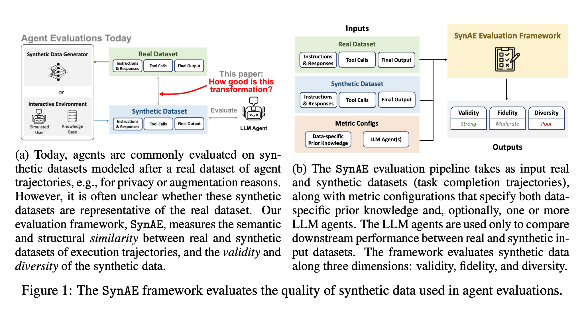

# SynAE: A Framework for Measuring the Quality of Synthetic Data for Agent Evaluations

This repository implements **SynAE**, a multi-axis evaluation framework for assessing how well synthetic benchmarks for multi-turn, tool-calling agents replicate and augment the characteristics of a real dataset of execution trajectories. SynAE evaluates synthetic data across four metric categories — (i) task instructions and intermediate responses, (ii) tool calls, (iii) final outputs, and (iv) downstream agent evaluation — and reports each along three orthogonal pillars: **validity**, **fidelity**, and **diversity**.



---

## Table of Contents

1. [Overview](#overview)
2. [Repository Layout](#repository-layout)
3. [Project Setup](#project-setup)
4. [Quickstart (`run.sh`)](#quickstart-runsh)
5. [Generating Synthetic Benchmarks](#generating-synthetic-benchmarks)
6. [Running SynAE Evaluation](#running-synae-evaluation)
7. [Downstream Agent Evaluation](#downstream-agent-evaluation)
8. [Metric Reference](#metric-reference)
9. [Datasets and Benchmarks](#datasets-and-benchmarks)
10. [Reproducing the Paper](#reproducing-the-paper)
11. [Acknowledgement](#acknowledgement)

---

## Overview

Tool-calling agent evaluations typically run over static benchmark datasets composed of agent trajectories: user inputs, intermediate responses, tool calls, and a final output. In production, real benchmark traces are often unavailable (privacy, proprietary content) or insufficient (sparse coverage), so practitioners increasingly substitute or augment them with synthetic trajectories. SynAE provides quantitative metrics to answer: *how good is this transformation from real to synthetic data?*

Given a dataset `D = {D_1, ..., D_m}` of `m` trajectories, each sample `D_i` consists of:

- **Instructions and responses** — `R_i = (r_{i,1}, r_{i,2}, ..., r_{i,L_i})`
- **Tool calls** — `F_i = (f_{i,1}(p_{i,1}), ..., f_{i,q_i}(p_{i,q_i}))`
- **Final output** — `O_i`

SynAE takes (1) a real dataset `D`, (2) a synthetic dataset `D'`, and (3) one or more downstream LLM agents `A_1, ..., A_h`. It evaluates the synthetic data along three pillars:

| Pillar | What it measures | When it matters |
|---|---|---|
| **Validity** | Whether tool calls and outputs accomplish the instruction | Synthetic data may look fluent but be unusable |
| **Fidelity** | Similarity between synthetic and real trajectories | Synthetic data is a *replacement* for real data (e.g., privacy) |
| **Diversity** | Coverage of the trajectory space | Synthetic data is an *augmentation* to fill coverage gaps |

Validity is computed via an LLM-as-a-judge by default (or rule-based checkers when available). Fidelity uses a mix of structural metrics (Key Node Dependency, Attribute Match, k-Step Tool Planning) and non-structural metrics (KNN-Precision/Recall, FID). Diversity uses reference-free metrics (Vendi Score, Attribute Diversity).

---

## Repository Layout

```
AgentEval/
├── figure/                         # Figures used in the paper
│   └── SynAE.png
│
├── SynDataGeneration/      # Synthetic benchmark generation (Hydra-managed)
│   ├── create_syn.py               # Main entry point: build synthetic benchmark
│   ├── classify_syn.py             # Tag synthetic samples with attributes
│   ├── collect_orig_syn_fps.py     # Collect (orig, syn) filepath pairs into a CSV
│   ├── extract_time.py             # Wall-clock cost per generation run
│   ├── configs_syn/                # Hydra config tree
│   │   ├── config.yaml
│   │   ├── orig_data/              # Per-benchmark dataset configs
│   │   └── syn_data/               # Per-method generation configs
│   ├── benchmarks/                 # Per-benchmark loaders / preprocessors
│   ├── orig_data/                  # Original benchmark data (T1, BFCL, ACP)
│   └── experimental/               # τ-bench / extra prototypes
│
├── Benchmarks/                     # Benchmark-specific runtimes & downstream evaluation
│   ├── T1 code/                    # T1 attractions: agents, judges, e2e scripts
│   ├── berkeley-function-call-leaderboard/   # BFCL fork w/ AgentEval glue scripts
│   ├── acp/                        # ACPBench runner (Applicability & Progression)
│   └── experimental/               # T1-Augmented prep: invalidate + case study
│
├── SynAE_Evaluation/               # The SynAE metric implementations
│   ├── evaluation_T1.py            # Metrics for T1
│   ├── evaluation_bfcl.py          # Metrics for BFCL
│   ├── evaluation_acp.py           # Metrics for ACP
│   └── precision_recall.py         # KNN-Precision/Recall + FID utilities
│
├── run.sh                          # Quickstart: generate + evaluate in one command
└── README.md
```

---

## Project Setup

Synthetic-data generation is managed with [`uv`](https://docs.astral.sh/uv/) and [Hydra](https://hydra.cc/). Each benchmark runtime under `Benchmarks/` has its own environment.

### 1. Clone the repo

```bash
git clone https://github.com/synae-2026/synae-code.git
cd synae-code
```

### 2. Install the synthetic-data generator

```bash
cd "SynDataGeneration"
uv sync
```

This installs `create_syn.py`'s dependencies, including `hydra-core`, `private-evolution` (DPSDA), `transformers`, and `datasets`.

### 3. Install evaluation dependencies

The metric scripts in `SynAE_Evaluation/` depend on:

```bash
pip install numpy pandas scipy scikit-learn faiss-cpu torch \
            sentence-transformers vendi-score python-Levenshtein \
            lark matplotlib seaborn tqdm
```

The shared KNN-Precision/Recall and FID utilities ship with the metric scripts in [`SynAE_Evaluation/precision_recall.py`](SynAE_Evaluation/precision_recall.py) — no separate install is needed.

### 4. Per-benchmark runtimes

| Runtime | Setup |
|---|---|
| T1 | `cd "Benchmarks/T1 code" && uv sync` (or `pip install -e .`) |
| BFCL | follow the upstream Berkeley FCL install instructions in `Benchmarks/berkeley-function-call-leaderboard/README.md` |
| ACP | `cd Benchmarks/acp && uv sync`; downstream eval uses vLLM (`run_acp.sh`) |

---

## Quickstart (`run.sh`)

A minimal driver script `run.sh` at the repo root chains synthetic-data generation and SynAE evaluation in a single command.

```bash
./run.sh                          # T1 + oversample @ dup_frac=0.5 (defaults)
./run.sh t1   blankfill   0.3     # T1 + Blank Filling at p=0.3
./run.sh bfcl fewshot     5       # BFCL + In-Context Generation with k=5
./run.sh acp  invalidate  0.7     # ACP + Invalidation at v=0.7
```

Positional arguments are `<benchmark> <method> <param>`:

- `benchmark`: `t1` | `bfcl` | `acp`
- `method`: `oversample` | `blankfill` | `fewshot` | `invalidate`
- `param`: numeric hyperparameter passed to the method (`dup_frac`, `blank_probability`, `n_examples`, or `invalidate_frac`)

Results are written to `eval_results/<bench>_<method>_<param>.json`. The script is intended for sanity checks and small sweeps; for full sweeps and downstream agent runs, use the explicit pipelines below.

---

## Generating Synthetic Benchmarks

Synthetic benchmarks are produced by `create_syn.py`, which is fully Hydra-managed. The default config (`configs_syn/config.yaml`) chains an `orig_data` config (which benchmark to start from) with a `syn_data` config (which generation method to apply).

### Run with defaults

```bash
cd "SynDataGeneration"
uv run python create_syn.py
```

The default loads `orig_data=t1_attraction` and `syn_data=oversample` and writes results to `outputs/YYYY-MM-DD/HH-MM-SS/`:

- `orig_df.csv` — loaded original data
- `orig_df_proc.csv` — pre-processed original data
- `syn_df_proc.csv` — generated synthetic data (processed)
- `syn_df.csv` — final synthetic data (post-processed)
- `.hydra/` — Hydra config snapshot

Multirun outputs land in `multirun/YYYY-MM-DD/HH-MM-SS/<run_idx>/`.

### Override parameters

```bash
# Switch to a larger T1 split
uv run python create_syn.py orig_data=t1_attraction_full

# Sweep duplication rate for Oversampling
uv run python create_syn.py -m \
    orig_data=t1_attraction \
    syn_data=oversample \
    syn_data.gen_params.dup_frac=0.1,0.3,0.5,0.7,0.9
```

### Supported benchmarks (`orig_data/`)

| Config | Source |
|---|---|
| `t1_attraction` | T1-attraction, train split 1 |
| `t1_attraction_med` | T1-attraction, train splits 1–15 |
| `t1_attraction_full` | T1-attraction, train splits 1–25 |
| `bfcl_multiturn_base` | BFCL v4 multi-turn base |
| `acp_app_prog` | ACPBench Applicability & Progression |

### Supported generation methods (`syn_data/`)

| Method | Hyperparameter | Purpose |
|---|---|---|
| `oversample` | `dup_frac` `r ∈ {0.1, …, 0.9}` | Limited diversity (duplication) |
| `blankfill` | `blank_probability` `p ∈ {0.1, …, 0.9}` | Degraded fidelity (token masking + LLM fill) |
| `fewshot` / `fewshot_random` | `n_examples` `k ∈ {0, 1, 3, 5}` | Combined fidelity / diversity (in-context generation) |
| `invalidate` | `invalidate_frac` `v ∈ {0, …, 1}` | Degraded validity (replace tool-call inputs / outputs) |
| `dropmin_*` | per-benchmark | Down-sample minority attribute values (case study) |

After generation, collect the original/synthetic filepath pairs and pipe them downstream:

```bash
uv run python collect_orig_syn_fps.py --runs_dir outputs/<date>/<time>
# Produces a CSV of (orig_path, syn_path) usable by Benchmarks/<bench> scripts
```

---

## Running SynAE Evaluation

The metric implementations live in `SynAE_Evaluation/`, with one file per benchmark. Each script computes the full SynAE metric grid (validity, fidelity, and diversity across instructions, tool calls, outputs, and downstream tasks where applicable) and writes a results JSON.

### T1

```bash
cd SynAE_Evaluation
python evaluation_T1.py \
    --syn_data_path  ../syn_data/oversample_05/syn_data.csv \
    --save_path      ../eval_results/oversample_05.json \
    --attr_category_path ../ori_data/category.csv \
    --method_name    oversample_r0.5
```

### BFCL

```bash
python evaluation_bfcl.py \
    --syn_data_path  ../syn_data/bfcl/blankfill_03/syn_data.csv \
    --save_path      ../eval_results/bfcl_blankfill_03.json \
    --attr_category_path ../ori_data/bfcl/category.csv \
    --method_name    blankfill_p0.3
```

### ACP

```bash
python evaluation_acp.py \
    --syn_data_path  ../syn_data/acp/fewshot_random_k3/syn_data.csv \
    --save_path      ../eval_results/acp_fewshot_random_k3.json \
    --attr_category_path ../ori_data/acp/category.csv \
    --method_name    fewshot_random_k3
```

The synthetic CSVs are expected to have at least the columns `Data` (instruction/response transcript), `Tool Call`, and (for T1 / ACP) `Output`. The scripts cache embeddings on first run for speed.

---

## Downstream Agent Evaluation

The downstream pillar of SynAE measures whether *user-provided agents* can complete tasks on the synthetic benchmark, then compares that with their performance on the real benchmark. Two metrics are reported:

- **Task Difficulty Difference (TDD)** — `|success_real − success_syn|`, averaged across agents.
- **Ranking Divergence (RD)** — Spearman correlation of agent rankings between real and synthetic.

The paper uses three open-source agents: `google/gemma-3-1b-it`, `Qwen/Qwen3-4B-Instruct-2507`, and `meta-llama/Llama-3.1-8B-Instruct`. `Mistral-7B-Instruct` is used as the LLM-as-a-judge for functional equivalence.

### T1

See `Benchmarks/T1 code/AGENT_EVAL_README.md`.

```bash
# 1. Build synthetic tool calls + outputs (instructions come from create_syn.py)
python orig_syn_e2e.py --filepaths_csv <from collect_orig_syn_fps.py>

# 2. Run agents on each (orig, syn) benchmark
python run_llm_on_orig_syn_bench_e2e.py --model meta-llama/Llama-3.1-8B-Instruct
python run_llm_on_orig_syn_bench_e2e.py --model google/gemma-3-1b-it
python run_llm_on_orig_syn_bench_e2e.py --model Qwen/Qwen3-4B-Instruct-2507

# 3. LLM-as-a-judge for functional equivalence
python llm_judge_on_orig_syn_results_e2e.py
```

### BFCL

See `Benchmarks/berkeley-function-call-leaderboard/AGENT_EVAL_README.md`. The pipeline is:

1. `format_syn_data_to_bfcl.py` to land synthetic data into `bfcl_eval/data/`
2. `run_<method>_fmt_for_sb.sh` to format the synthetic instructions and tool calls for evaluation
3. `./run_model_on_all_benchmarks.sh <model>` per agent
4. `collect_model_scores.py` for the BFCL native scores; `run_llm_judge_model_all_gen.sh` for the LLM-as-a-judge scores

### ACP

See `Benchmarks/acp/AGENT_EVAL_README.md`. Run all three agents in sequence:

```bash
CUDA_VISIBLE_DEVICES=0,1 bash run_acp.sh vllm_configs/gemma3_1b_it.yaml 2
CUDA_VISIBLE_DEVICES=0,1 bash run_acp.sh vllm_configs/llama3_1_8b_it.yaml 2
CUDA_VISIBLE_DEVICES=0,1 bash run_acp.sh vllm_configs/qwen3_4b_it.yaml 2
```

ACP uses a rule-based validity checker, so no LLM judge is required for the validity pillar.

---

## Metric Reference

### Validity

- **Validity Rate (VR)** — fraction of samples whose tool calls and/or outputs accomplish the instruction. Default judge: LLM-as-a-judge (`Mistral-7B-Instruct`); rule-based checker for ACP.

### Fidelity

| Category | Metric | Description |
|---|---|---|
| Instructions & Responses | **Key Node Dependency (KND)** | Distributional distance between embedding similarities of (instruction, response) and (response, instruction) pairs — captures structural dependencies |
| Instructions & Responses | **Attribute Match (AM)** | Wasserstein-2 (numeric) / TV distance (categorical) over user-defined attributes (turn count, token length, semantic tags) |
| Instructions & Responses | **KNN-Precision / KNN-Recall** | Standard precision/recall in embedding space (`text-embedding-3-small` by default) |
| Instructions & Responses | **FID** | Fréchet distance over embeddings |
| Tool Calls | **Tool Usage Match (TUM)** | TV distance between tool-usage distributions `w_f` vs. `w_f'` |
| Tool Calls | **Tool Call Number Match (TCNM)** | Wasserstein-2 over per-sample tool-call counts `q_i` |
| Tool Calls | **k-Step Planning** | Weighted TV distance between conditional next-tool distributions given the previous `k − 1` calls; defaults `k ∈ {1, 2}` |
| Outputs | **KNN-Precision / Recall, FID** | Same as instruction-level, applied to `O_i` |
| Downstream | **Task Difficulty Difference (TDD)** | Mean absolute success-rate gap across agents |
| Downstream | **Ranking Divergence (RD)** | Spearman correlation of agent rankings between real and synthetic |

Lower is better for KND, AM, TUM, TCNM, k-Step Planning, FID, and TDD. Higher is better for KNN-Precision/Recall and RD.

### Diversity

- **Vendi Score** — exponential entropy of the eigenvalues of a normalized similarity matrix `K / m`. Used for instructions, tool calls (with `K_{i,j} = 1 − Levenshtein(F_i, F_j) / max(q_i, q_j)`), and outputs.
- **Attribute Diversity (AD)** — entropy of the attribute-value distribution over user-specified attributes (e.g., (`attraction_type`, `city`)).

Both metrics are reference-free (do not require access to real data), though SynAE optionally compares real vs. synthetic diversity.

---

## Datasets and Benchmarks

The paper evaluates SynAE on three real-data benchmarks:

| Benchmark | # Samples | Notes |
|---|---|---|
| **T1** [Chakraborty et al., 2025] | 225 | T1-attraction multi-turn instructions, reference tool calls, and final outputs |
| **BFCL** [Patil et al., ICML] | 200 | BFCL-V3-Base-Multi-Turn (file ops, math, travel booking) |
| **ACP** [Kokel et al., AAAI 2025] | 260 | ACPBench-Applicability & Progression (planning domains: ferry, robots, etc.) |

For T1, the original benchmark only ships instructions + tool calls. The repo includes a **T1-Augmented** pipeline under `Benchmarks/experimental/` that:

1. Synthesizes outputs with an LLM, then
2. Filters with `get_valid_t1_aug.py` (LLM-as-a-judge) to produce `orig_valid.csv`.

The validity experiments (`get_t1_invalidate_tc.py`, `get_t1_invalidate_output.py`) and the diagnose-and-refine case study (`get_t1_case_study.py`) build on top of this filtered T1-Augmented data.

---

## Reproducing the Paper

The headline results (paper Table 5, Figs. 4–8) sweep four controlled-failure generators and one realistic generator (NVIDIA NeMo) over T1, BFCL, and ACP. To reproduce a single curve:

```bash
# 1. Generate
cd "SynDataGeneration"
uv run python create_syn.py -m \
    orig_data=t1_attraction \
    syn_data=blankfill \
    syn_data.gen_params.blank_probability=0.1,0.3,0.5,0.7,0.9

# 2. Pair up filepaths
uv run python collect_orig_syn_fps.py --runs_dir multirun/<date>/<time>

# 3. Generate tool calls + outputs (T1 only — instructions only come from step 1)
cd "../Benchmarks/T1 code"
python orig_syn_e2e.py --filepaths_csv <csv from step 2>

# 4. Score with SynAE
cd ../../SynAE_Evaluation
for run in ../syn_data/blankfill_*; do
    python evaluation_T1.py \
        --syn_data_path "$run/syn_data.csv" \
        --save_path     ../eval_results/T1.json \
        --method_name   "$(basename $run)"
done

# 5. (Optional) downstream eval — three agents through each benchmark
cd "../Benchmarks/T1 code"
for m in meta-llama/Llama-3.1-8B-Instruct google/gemma-3-1b-it Qwen/Qwen3-4B-Instruct-2507; do
    python run_llm_on_orig_syn_bench_e2e.py --model "$m"
done
python llm_judge_on_orig_syn_results_e2e.py
```

The `SynDataGeneration/extract_time.py` utility collects per-run wall-clock cost. For reference, the paper notes that running all SynAE evaluations against the three datasets with the open-source agents and `Mistral-7B-Instruct` as judge costs under \$5/dataset if substituting `GPT-5.4-mini`.

---

## Acknowledgements

- [T1](https://arxiv.org/abs/2505.16986) — multi-turn tool-oriented conversational benchmark
- [Berkeley Function Calling Leaderboard (BFCL)](https://gorilla.cs.berkeley.edu/) — multi-turn function-calling benchmark
- [ACPBench](https://arxiv.org/abs/2502.03734) — reasoning about action, change, and planning
- [NVIDIA NeMo](https://www.nvidia.com/en-us/ai-data-science/products/nemo/) — synthetic-data generator used as a realistic baseline
- [Vendi Score](https://github.com/vertaix/Vendi-Score) — diversity metric implementation
- [DPSDA](https://github.com/microsoft/DPSDA) — Aug-PE generation backbone
- [Struct-Bench / structpe](https://github.com/wsqwsq/structpe) — structural-fidelity inspirations (KND, AM)

---

**Disclaimer:** This codebase is research code accompanying a NeurIPS 2026 submission. Expect interface changes as we incorporate community feedback.
